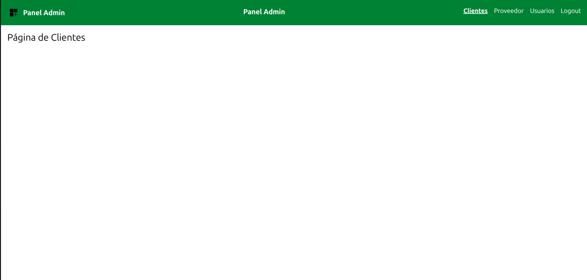

## Estructura del Proyecto
src/
 ├── components/
 │    └── Navbar.jsx
 ├── pages/
 │    ├── Clientes.jsx
 │    ├── Proveedor.jsx
 │    ├── Usuarios.jsx
 │    └── Logout.jsx
 ├── App.jsx
 └── main.jsx

 # Panel Administrativo React

## Descripción

Aplicación web desarrollada con React y Vite que simula un panel administrativo con navegación entre módulos.

## Tecnologías Utilizadas

* React
* Vite
* React Router DOM
* Tailwind CSS

## Funcionalidades

* Navegación sin recarga
* Vistas: Clientes, Proveedor, Usuarios, Logout
* Diseño moderno con Tailwind

## Creación del proyecto

Se inicializó el proyecto utilizando Vite con React:
npm create vite@latest panel-admin
cd panel-admin
npm install
npm run dev

## Instalación de dependencias

```bash
npm install
npm run dev
npm install react-router-dom
npm install -D tailwindcss postcss autoprefixer
npm install -D tailwindcss @tailwindcss/vite
```
## Configuración de Tailwind CSS

Se configuró el archivo tailwind.config.js:
content: [
  "./index.html",
  "./src/**/*.{js,ts,jsx,tsx}",
]

## Implementación de rutas

Se configuró el enrutamiento con React Router:
Uso de BrowserRouter, Routes y Route, 
Navegación sin recarga con NavLink

## Creación del Navbar

Se diseñó una barra de navegación con:
Logo,
Enlaces a las diferentes vistas

## Desarrollo de vistas

Se crearon las páginas:
Clientes, 
Proveedor, 
Usuarios, 
Logout, 
Cada vista incluye un título visible.

## Mejoras de interfaz

Se aplicaron estilos con Tailwind CSS:
Colores personalizados, 
Diseño responsive, 
Efectos hover y estilos activos en navegación

## Captura



## Repositorio

https://github.com/Neiber82828/Panel_admin.git
